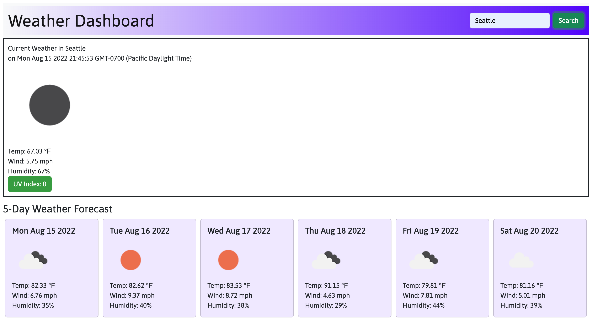

# weather-dashboard

## This was created in order to help others prepare for current and future weather conditions. By working on this project, I learned how to use third-party APIs, utilize bootstrap, and practice my Javascript skills.

## Links

- https://github.com/bburton5/weather-dashboard
- https://bburton5.github.io/weather-dashboard/

## Usage

This webpage can be used to know what the weather will be and what it currently is. This can be useful because people can plan their events around weather conditions or avoid doing certain things during harsh weather.

## Credits

- StackOverflow
- MDN
- w3schools
- Open Weather API
